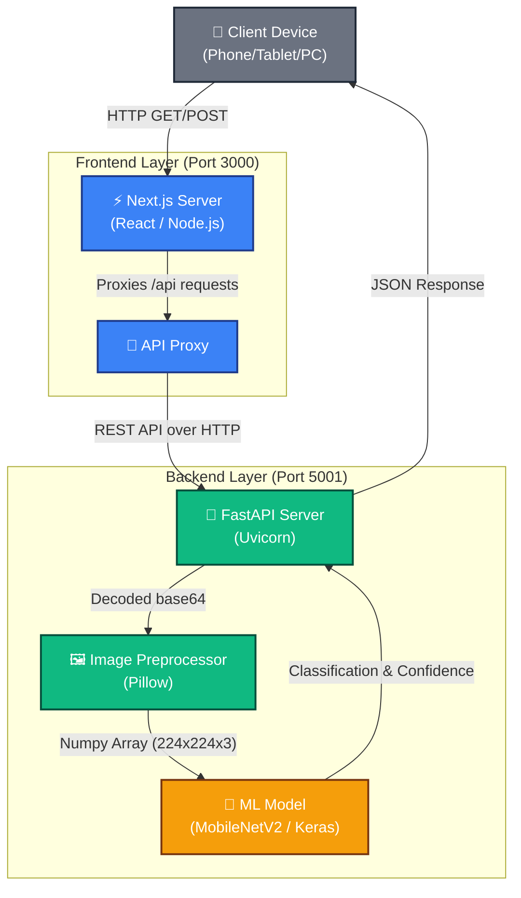

# System Architecture

The Anode Cover Inspector is designed as a decoupled, modern web application consisting of a React-based frontend and a Python-based backend handling the Computer Vision workload.

## High-Level Architecture

The system follows a standard Client-Server architecture:



## Component Breakdown

### 1. Frontend Layer
Built with **Next.js 16 (App Router)** and **Tailwind CSS**.
- **Role:** Serves the User Interface, handles image selection, and provides immediate visual feedback.
- **Image Handling:** Images are immediately resized and converted to base64 on the client device using the FileReader API. This prevents massive payload bottlenecks.
- **Proxying:** The `next.config.mjs` file dictates that all requests to `/api/*` are proxied to the backend. This eliminates CORS issues and allows seamless mobile access.

### 2. Backend Layer
Built with **FastAPI** running on **Uvicorn**.
- **Role:** Exposes robust REST endpoints for system health and model inference.
- **Performance:** FastAPI is asynchronous by default. The endpoints are stateless, allowing the backend to scale easily if deployed in a containerized cluster.
- **Security:** Strict CORS middleware and Content Security Policies (CSP) are enforced at the backend level.

### 3. Machine Learning Layer
- **Model:** A transfer-learned **MobileNetV2** architecture.
- **Input:** Raw RGB pixel data resized to `224x224`. Normalization is baked directly into the model's first Keras layer (Rescaling), ensuring preprocessing logic is foolproof.
- **Output:** A sigmoid activation yielding a single probability score, mapped to either `OK` (acceptable) or `NG` (no good / defect).

## Directory Structure
```
ac-inspect/
├── backend/          # Python backend environment
│   └── app.py        # Main FastAPI entry point
├── frontend/         # Next.js workspace
│   ├── app/          # App router pages (page.tsx, layout.tsx)
│   ├── components/   # UI logic (image-upload, result-display)
│   └── lib/          # API wrapper functions (api.ts)
├── weights/          # Deep learning model artifacts
└── ml/               # Scripts used for training and evaluating the model
```
